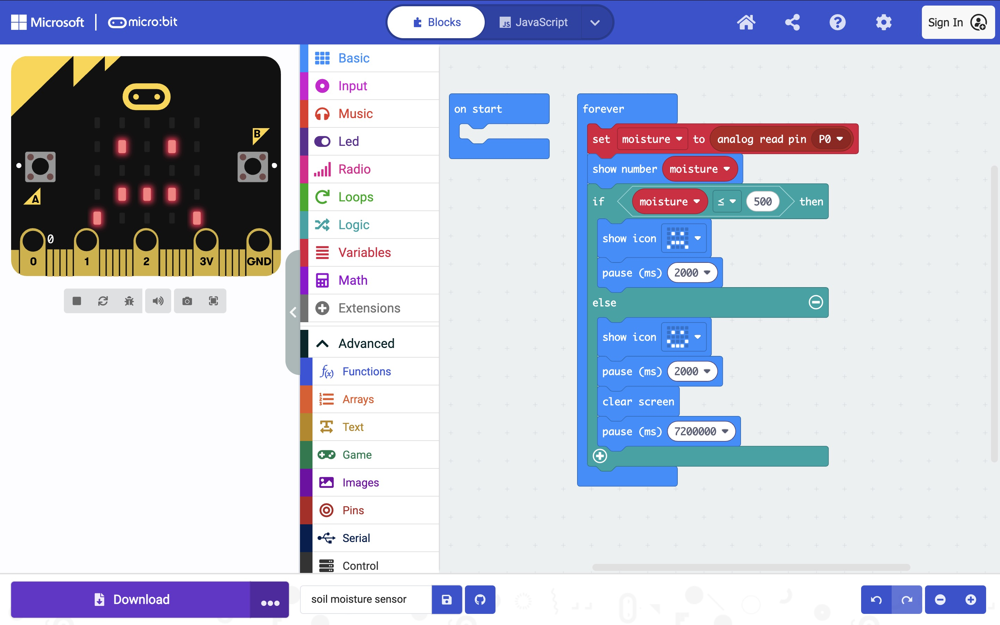

# Smart Plant Soil Moisture Monitor (micro:bit Project)

This project is a simple prototype that detects soil moisture using a BBC micro:bit and two metal nails as improvised soil probes. It displays a happy face when the soil is wet and a sad face when the soil is dry. The prototype is designed as a low-cost solution to help beginner programmers and plant owners monitor soil moisture.

## Project Description

This project is a simple soil moisture monitoring system built using a BBC micro:bit. It was designed to solve a real problem: my grandmother often forgot to water her plants, and some of them dried out. To help her, I built a low-cost moisture reminder system.

Instead of using an expensive moisture sensor, two iron nails are used as simple soil probes. The moisture level is measured using analog voltage changes on pin P0. When the soil becomes dry, the micro:bit shows a 😢 icon to remind that watering is needed. When the soil is wet, a 😊 icon is displayed.

The system runs on two AAA batteries, so it is easy to place in small indoor flower pots. It is affordable, simple to assemble, and suitable for beginner-level physical computing.

## Features
- Detects soil moisture using analog input
- Simple visual feedback using micro:bit LED icons
- Low-cost design using iron nails as probes
- Portable: powered by 2 × AAA battery pack
- Customizable moisture threshold
- Improved power efficiency using low-frequency sampling
  
## Materials

| Item | Quantity | Description |
|------|----------|-------------|
| BBC micro:bit V2 | 1 | Main microcontroller board |
| Battery pack (2 × AAA) | 1 | Power supply |
| USB cable | 1 | Used for programming |
| Iron nails (12 cm) | 2 | Used as soil probes |
| Crocodile clip wires | 2 | Connection wires |
| Pot with dry soil | 1 | For testing dry condition |
| Pot with wet soil | 1 | For testing wet condition |

## Wiring

Two iron nails are used as soil probes. They are inserted into the soil with a small distance between them . Crocodile clips are used to connect the nails to the micro:bit.

| micro:bit Pin | Connection |
|---------------|------------|
| P0 | Nail probe 1 |
| 3V | Nail probe 2 |
| GND | Not used |
| P1/P2 | Not used |

This setup measures how well electricity passes through the soil. Wet soil conducts better than dry soil, so the voltage detected on P0 changes with moisture.

---
## How It Works

This project estimates soil moisture using the electrical conductivity method. Two iron nails are used as probes and inserted into the soil with a small gap between them. When the soil contains water, it also contains dissolved ions that allow electricity to pass through it. Wet soil therefore conducts electricity better than dry soil, which has higher resistance.

In this prototype, the 3V pin provides a small voltage** to the soil and pin P0 measures the voltage that returns through the soil. The moisture level is detected as an analog value between 0 and 1023. A lower reading means low conductivity (dry soil), while a higher reading indicates high conductivity (wet soil).

The analog reading from pin `P0` ranges from **0 to 1023**. A threshold of **500** was chosen as an initial midpoint reference to separate dry and wet soil conditions during prototyping. This value can be adjusted later through calibration.

## Program Logic

The program continuously measures the moisture level from pin P0 and compares it to a threshold. The logic is:

1. Read the moisture value using `analog read pin P0`
2. Compare the value with a threshold of 500
3. If the value is lower or equal to 500 → the soil is dry → show 😭
4. If the value is higher than 500 → the soil is wet → show 😊
5. Wait before the next measurement to save battery power

The value from P0 is stored in a variable called `moisture`. A delay is added using `pause(7200000)` so the device checks the soil every 2 hours instead of constantly. This reduces battery use.

## Testing and Results

The prototype was tested using two conditions: dry soil and wet soil. The moisture readings were displayed on the micro:bit during testing.

| Test Condition | Moisture Reading (P0 value) | Result |
|----------------|-----------------------------|--------|
| Dry soil       | ~850                        | 😢 Dry |
| Wet soil       | ~420                        | 😊 Wet |

*Note: These values are approximate and will be updated after calibration testing.*

## Power Saving Design

A simple power-saving method was added to make the prototype more practical when running on batteries. Instead of measuring soil moisture continuously, the program waits between readings using a delay function. The micro:bit checks the soil once every 2 hours (`pause(7,200,000 ms)`). This reduces unnecessary energy use and helps the battery last longer.

Without this delay, the micro:bit would read the sensor thousands of times per minute inside the forever loop, which would drain the battery quickly. In addition, the LED screen is cleared after each reading to minimise power consumption.

## Limitations

- The measurement is not highly accurate** because it uses simple iron nails instead of a calibrated soil moisture sensor.
- The P0 + 3V method works but can cause electrolysis, which may slowly corrode the metal probes over time.
- The readings can change depending on soil type, temperature, and minerals in the soil.
- The system only gives a binary output (“dry” or “wet”) instead of showing an exact moisture percentage.
- The probe distance and depth in the soil can affect the readings.

These limitations are expected for a low-cost prototype, but the system still works well as a simple plant care reminder device.

## Future Improvements

- Calibration button: Add a button-based calibration so the threshold automatically adjusts to different soil types.
- Better probe material: Replace iron nails with stainless steel or graphite electrodes to reduce corrosion.
- Multiple sensor averaging: Use multiple readings and calculate an average to reduce noise in the data.
- Low-power sleep mode: Fully implement deep sleep to extend battery life instead of using only delay-based sampling.
- Automatic watering system: Add a relay module and water pump to turn this project into a self-watering system.
- Data logging: Send moisture data to a computer or cloud for logging and monitoring.

